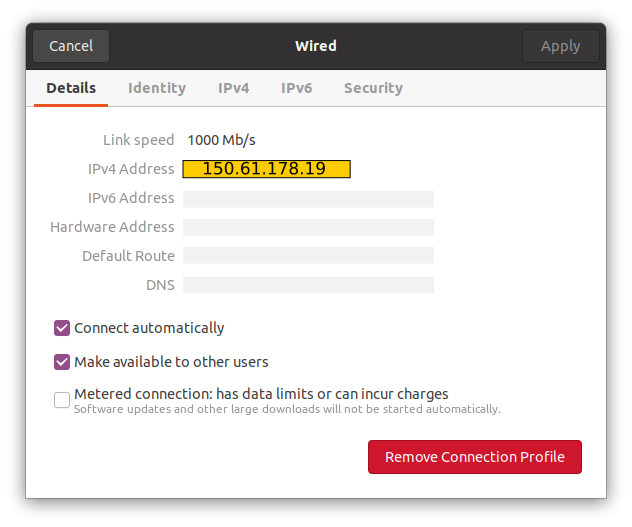
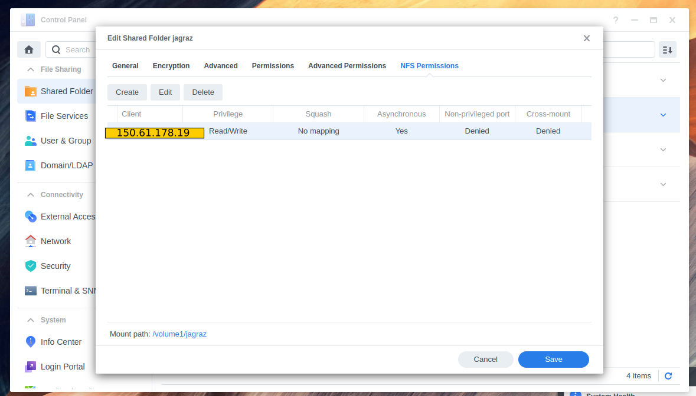

# Mount Synology NFS share to Ubuntu 20.04LTS
Mounting a Synology NAS on Linux is simple, but can present challenges and potentially waste valuable time. This repository outlines the procedure to mount a Synology DS1821+ (DSM 7.1.1) on an Ubuntu 20 system. The outlined steps are likely compatible with other Synology models and Linux distributions, requiring minimal modifications if any.
  
## On the Ubuntu 20.04LTS System 
1. Click the pull-down menu icon on the top-left bar
2. Goto `Settings`
3. On the `Ethernet (...)` connection in use, click on the `gear`
4. Goto `IPv4` and take note of the `IPv4 Address`. Ex 150.61.178.19



## On the Synology box
1. Goto `Control Panel`
2. Click `Shared Folder` and find your share you want to mount
3. Click `Edit`
4. Goto `NFS Permissions`
5. Click `Create`
6. In the `Hostname or IP` box, enter the Ubuntu 20 `IPv4 Address` found above
7. Click save
8. Take note of the `Mount path` located at the bottom of the window. Ex /volume1/jagraz
9. Click save



## On the Ubuntu Box
1. Open Terminal and type: 
```text 
sudo apt-get install nfs-common -y
```
2. Make a directory to mount to using the command below. Replace `my_mount_location` for the directory name of your choosing
```text 
sudo mkdir /media/my_mount_location
```
3. Change the access premissions, at the Open Terminal type:
```text 
sudo chmod -R 755 my_mount_location
```
4. At the Open Terminal, type:
```text 
sudo gedit /etc/fstab
```
5. At the bottom of the fstab file, type:
```text
# automount from synology box
150.65.138.4:/volume1/shared_folder /media/my_mount_location nfs nouser,rsize=8192,wsize=8192,atime,auto,rw,dev,exec,suid 0 0
```
Where:  
`150.65.138.4` is the static IP of the Synology box  
`/volume1/shared_folder` is your mount path shared folder noted earlier  
`/media/my_mount_location` is the folder created in step 2  

6. Save the fstab file and on the Open Terminal type command below or reboot:
```text 
sudo mount -a
```
7. Navigate to the folder created in Step 2, files should be there  

## Troubleshooting
1. Remove the text in the fstab file from step 5, reboot, and start over
2. Make sure the permissions on the mounting directory in step 3 are correct
3. Verify the IP addresses for the Ubuntu machine and Synology box are correct
4. Verify the IP address entered in `Hostname or IP` box is correct
5. Check directory/files permissions. Check user "id -u" and if need be, change permissions using the code below:
```text 
   sudo chown -R $(id -u):$(id -g) /path/to/directory
```
  
[Thanks so much to Jack DeSive](https://gist.github.com/jdesive/07139df545a6fd6adf03f6a3b9075814)
